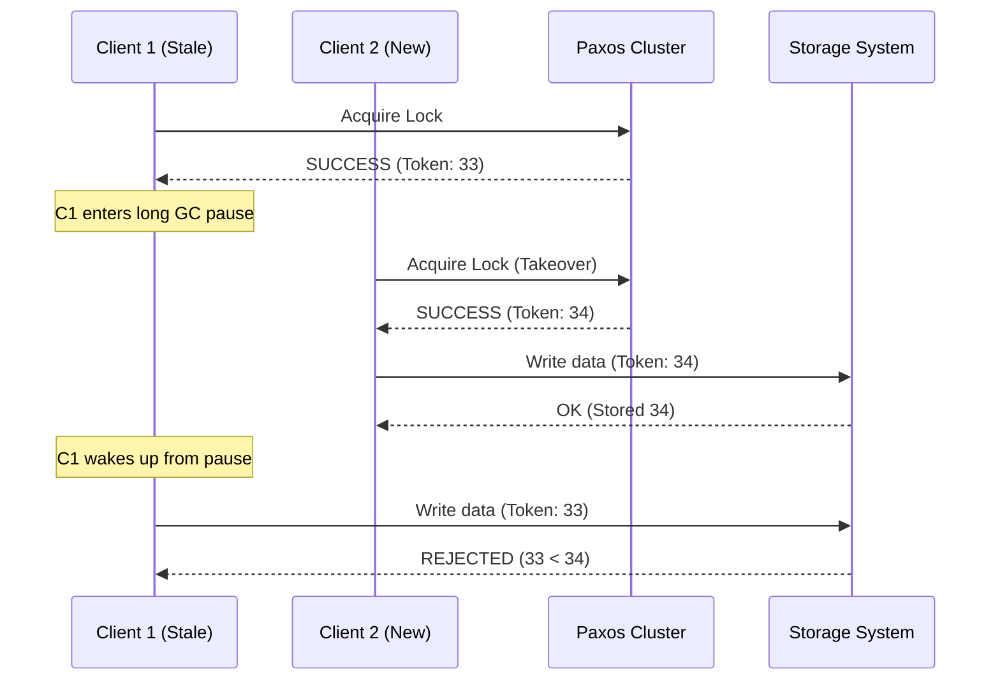

# Paxos-based Distributed Lock

This directory contains a prototype of a distributed lock implemented using a consensus-based approach (simplified Paxos), designed to address the fundamental safety limitations of algorithms like Redlock.

## Why Redlock is Not Enough

This analysis and the following prototype are largely based on the critical analysis by Martin Kleppmann in his article [How to do distributed locking](https://martin.kleppmann.com/2016/02/08/how-to-do-distributed-locking.html).

Redlock (and similar TTL-based locks) relies on **physical time** for safety. In distributed systems, this is a dangerous assumption for several reasons:

### 1. The Clock Drift Scenarios
In Redlock, a client calculates if it has the lock by: `Lock Validity Time = TTL - (CurrentTime - StartTime)`. This assumes all Redis nodes and the client agree on what "one second" is.

**Example of failure:**
- **Node A, B, C, D, E** all have a 1s TTL lock.
- **Node C's clock jumps forward** by 1.1s due to an NTP sync while the lock is held.
- **Node C now thinks the lock has expired** and is ready to give it to someone else.
- If this happens on enough nodes (or in combination with other delays), a new client can acquire the lock while the first client still thinks it's the owner.

### 2. The Network & Quorum Delay
Redlock requires a quorum (3 out of 5) to agree. However, there is no "leader" to coordinate.

**Example of failure:**
- **Client 1** tries to acquire the lock. It reaches Nodes A and B, but is delayed reaching C, D, and E.
- **Client 2** tries to acquire the same lock. It reaches Nodes D and E, but is delayed reaching A, B, and C.
- Both clients now hold partial locks. They will eventually time out and retry, but in a high-concurrency "million request" scenario, this creates **massive contention and "Live Lock"** where no one can progress.

### 3. Process Pauses (The STW GC Problem)
A client might acquire a lock and then hit a long **Stop-The-World (STW) Garbage Collection** pause.
- **T0**: Client A acquires lock (TTL 1s).
- **T1**: Client A starts a GC pause that lasts 2 seconds.
- **T2**: The lock expires on the Redis nodes.
- **T3**: Client B acquires the lock.
- **T4**: Client A wakes up from GC, thinks it still has the lock (since it didn't "experience" the 2 seconds), and performs a write.
- **Result**: Data corruption as two clients wrote to the same resource.

## The Consensus Solution (Paxos/Raft)

Consensus-based locks solve these issues by using **logical time** and **fencing tokens**. Instead of relying on a "wait time" (TTL), the system agrees on the owner and a monotonically increasing sequence number.

### How it solves Redlock's problems:

1.  **No physical clock dependency**: Paxos uses "ballot numbers" or "sequence numbers". Even if Node A thinks it's 2025 and Node B thinks it's 1990, they can still agree that `Sequence 34` comes after `Sequence 33`.
2.  **Leader Coordination**: By electing a leader node, we avoid the "Live Lock" scenario where two clients grab partial quorums. The leader handles all requests sequentially, ensuring that only one proposal is active for a specific lock at a time.
3.  **Fencing Tokens (The GC fix)**: This is the most critical part. Even if a client pauses for 100 years, when it wakes up, it presents its "Fencing Token". The storage system (e.g., a database or file system) checks its own record of the "last successful token". If the client's token is older, the write is rejected regardless of the client's local "lock ownership" belief.

> [!IMPORTANT]
> **Redis and Fencing Tokens**: Redis does not have a native way to generate monotonically increasing fencing tokens or to automatically validate them upon write. While algorithms like Redlock provide a lock, they do not provide the safety of a fencing token. This is why a leader-based consensus system (which can issue and track these tokens) is required for strict safety.

### Core Components (Consolidated in PaxosDemo.java)

1.  **Paxos Cluster**: A group of nodes (simulated as `Node` objects) that must reach a quorum (3/5) to agree on who owns the lock.
2.  **Fencing Tokens**: Every time a lock is acquired, the cluster calculates a new token (monotonically increasing) issued to the holder.
3.  **Storage Validation**: A simulated storage class that rejects any write with a token that isn't strictly greater than the last processed token.

### Monotonic Fencing in Action



## Running the Paxos Demo

You can run the Paxos demonstration using Docker:

```bash
docker compose --profile paxos up --build
```

The demo simulates a scenario where Client A acquires a lock, experiences a "pause", Client B takes over the lock with a higher token, and Client A's subsequent "stale" write is safely rejected by the storage system.

## Network Tolerance & Partitioning

The `PaxosDemo` implementation offers significantly better safety and reliability in a production data center environment for two main reasons:

### 1. Simplified Network Topography
In Redlock, the client acts as the coordinator across 5 different Redis nodes. This means a network glitch between the **client and any node** can lead to partial locks or timeouts.
In our Paxos prototype, the consensus cluster is hosted in the **data center (server-side)**.
- **Low Latency**: Inter-node communication within a data center is extremely fast and reliable.
- **Client Independence**: The client only needs to reach the cluster (or a leader); it doesn't have to worry about individual node connectivity.

### 2. Handling Network Partitions (The 3/5 Quorum)
Paxos is designed to handle partitions gracefully. If the network splits, the side with the **majority (quorum)** can continue, while the minority side automatically freezes to prevent split-brain.

**Example: Network Partition (3 vs 2)**
- **Nodes A, B, C** can see each other.
- **Nodes D, E** are isolated.
- **Client 1** talks to the A-B-C group: Consensus is reached (3/5), lock is issued.
- **Client 2** talks to the D-E group: Cannot reach a quorum (2/5 < 3). **No lock is issued.**
- **Result**: Safety is guaranteed even if 40% of your network is down.

### 3. Native Fencing Token Generation
Unlike plain Redis, which only manages keys and expirations, the `PaxosDemo` generates **monotonically increasing fencing tokens** as a core part of the protocol.
- Every successful "Accept" phase increments the sequence number.
- This token is the ultimate source of truth for the storage system, rendering physical clock drift irrelevant.

### Key Observation
Notice that even if the clocks on the nodes were completely out of sync, the **sequence number** (fencing token) ensures that only the current valid lock holder can modify the system state.
